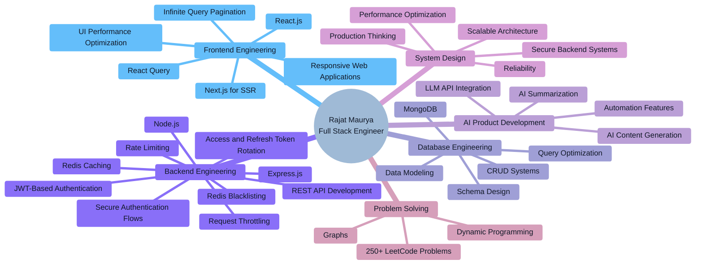

<table>
<tr>
<td width="60%" valign="center">

<h1>
  Hi , I'm <code>Rajat Maurya</code>
</h1>

<h3>🚀 Full Stack Engineer | MERN + AI Systems Builder</h3>

  

  
  &nbsp;&nbsp;&nbsp;
  
  &nbsp;&nbsp;&nbsp;
  

</td>

<td width="40%" align="right">

</td>
</tr>
</table>

---

## About Me

- 🔹 Building **production-grade full-stack MERN applications** with real-world architecture  
- 🔹 Solved **250+ LeetCode problems** to strengthen problem-solving and coding skills  
- 🔹 Learning **backend engineering, Redis, caching, and system design**  
- 🔹 Integrating **AI-powered features** into scalable web applications  

  🚀 <i>Focused on building secure, scalable, and real-world AI-powered products.</i>

---

## 🛠️ Tech Stack

### 💻 Core Programming

  

### 🎨 Frontend

  

### ⚙️ Backend

  

### 🗄️ Databases

  

### 🔧 Tools

  
  &nbsp;&nbsp;
  

---

## ✦ Engineering Focus

  <i>Focused on mastering the intersection of full-stack engineering, scalable backend architecture, AI-powered products, and high-level problem solving.</i>

---

## 🚀 Featured Project

<table>
  <tr>
    <td width="50%">
      <h3>Postify — AI Powered Blogging Platform</h3>
      

        A production-grade MERN blogging platform with AI features, strong authentication, moderation, and analytics.
      

      <ul>
        <li>✅ AI content generation, summarization & quality reports</li>
        <li>✅ Secure auth (JWT, Google OAuth, OTP verification)</li>
        <li>✅ Role-based admin dashboard, moderation & usage analytics</li>
      </ul>
      

        
        
      

    </td>
    <td width="50%">
      
   
   
  </tr>
</table>

---

## 📊 GitHub Contribution Activity

  

