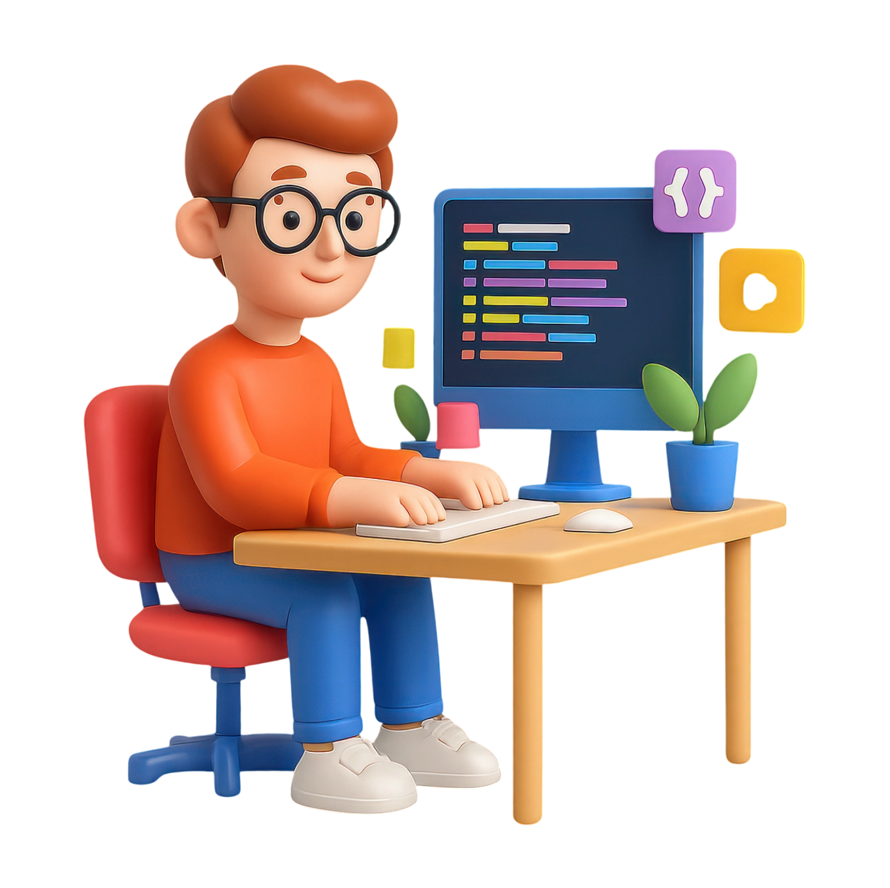
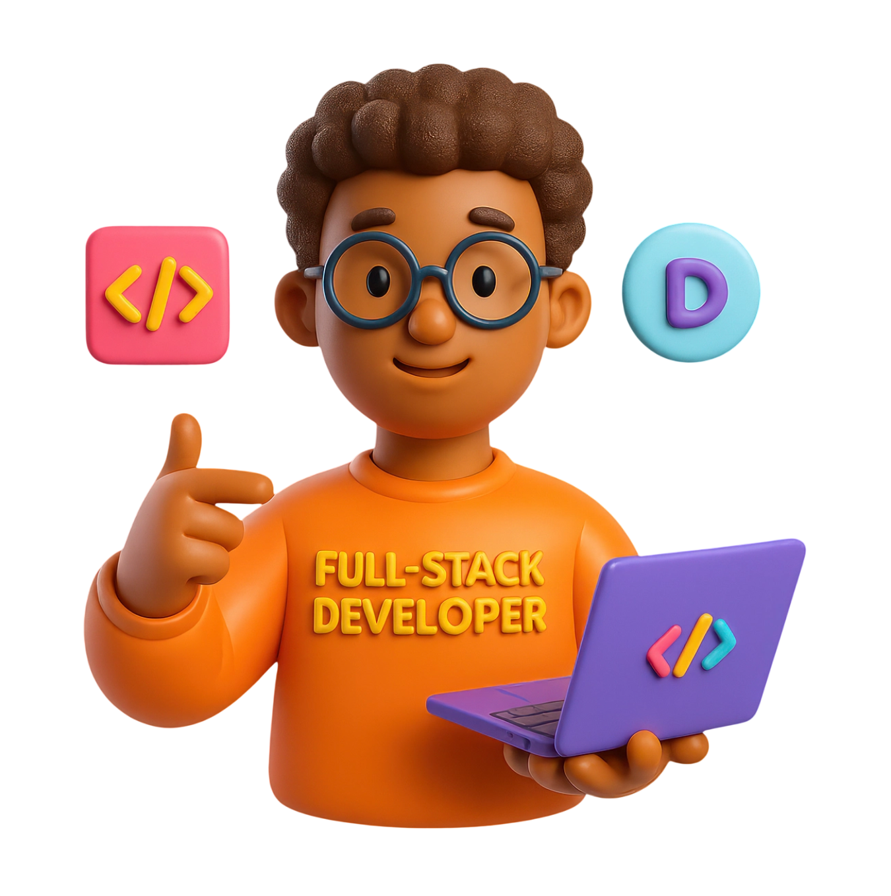
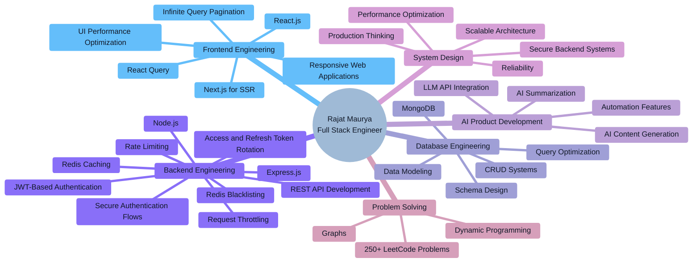

<!-- Section 1: Intro + Hero7 -->
<table width="100%" cellpadding="0" cellspacing="0">
<tr>
<td align="center" valign="middle" width="58%">

<h1>
Hi , I'm <code>Rajat Maurya</code>
</h1>

</td>

<td align="center" valign="middle" width="42%">

</td>
</tr>
</table>

<!-- Section 2: Title + Typing + Socials + second.png -->
<table width="100%" cellpadding="0" cellspacing="0">
<tr>
<td align="center" valign="middle" width="58%">

### 🚀 Full Stack Engineer | MERN + AI Systems Builder

  

&nbsp;&nbsp;
&nbsp;&nbsp;

</td>

<td align="center" valign="middle" width="42%">

</td>
</tr>
</table>

---
## About Me

<ul>
<li>🔹 Building <b>production-grade full-stack MERN applications</b> with real-world architecture</li>
<li>🔹 Solved <b>250+ LeetCode problems</b> to strengthen problem-solving and coding skills</li>
<li>🔹 Learning <b>backend engineering, Redis, caching, and system design</b></li>
<li>🔹 Integrating <b>AI-powered features</b> into scalable web applications</li>
</ul>

  🚀 <i><b>Focused on building secure, scalable, and real-world AI-powered products.</b></i>

---

## 🛠️ Tech Stack

### 💻 Core Programming

  

### 🎨 Frontend

  

### ⚙️ Backend

  

### 🗄️ Databases

  

### 🔧 Tools

  
  &nbsp;&nbsp;
  

---

## ✦ Engineering Focus

  <i>Focused on mastering the intersection of full-stack engineering, scalable backend architecture, AI-powered products, and high-level problem solving.</i>

---

## 🚀 Featured Project

<table>
  <tr>
    <td width="50%">
      <h3>Postify — AI Powered Blogging Platform</h3>
      

        A production-grade MERN blogging platform with AI features, strong authentication, moderation, and analytics.
      

      <ul>
        <li>✅ AI content generation, summarization & quality reports</li>
        <li>✅ Secure auth (JWT, Google OAuth, OTP verification)</li>
        <li>✅ Role-based admin dashboard, moderation & usage analytics</li>
      </ul>
      

        
        
      

    </td>
    <td width="50%">
      
   
   
  </tr>
</table>

---

## 📊 GitHub Contribution Activity

  

