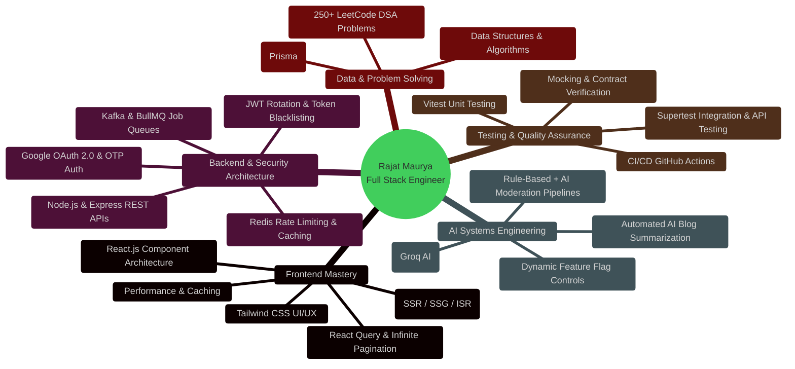

<a href="https://github.com/rajatmaurya-cs"></a>
# 👋 Hi, I'm **Rajat Maurya**

### ⚡ Backend Engineer <br/> ⚡ Event-Driven Systems <br/> ⚙️ Kafka, Redis & BullMQ

<br/>

- 💼 **Frontend Developer Intern** @ **SmallFare**
- 🚀 Creator of **Veyra** — AI-Powered Creator Platform
- 🧩 **250+ DSA Problems Solved** on LeetCode

<br/>

<p align="left">
  <a href="mailto:rajatmaurya.dev@gmail.com" title="Email Rajat"></a>
  <a href="https://www.linkedin.com/in/rajat-maurya-3a172331b" target="_blank" title="LinkedIn Profile"></a>
  <a href="https://github.com/rajatmaurya-cs" target="_blank" title="GitHub Profile"></a>
</p>

<br clear="both"/>

---

## 👨‍💻 About Me

I am a **Software Engineer** with expertise in **backend engineering**, **distributed systems**, and **full-stack development**. I build scalable, secure, and high-performance applications using **Node.js**, **Express.js**, **Next.js**, **React**, **PostgreSQL**, **Redis**, **Kafka**, and **BullMQ**. My work focuses on designing reliable APIs, event-driven architectures, background job processing, authentication systems, and modern web applications with an emphasis on scalability, reliability, and performance.

- 🎯 **Core Strengths:** Secure Authentication Systems • Testing & QA • Rate Limiting & Caching • AI Content Moderation Pipelines • Role-Based Dashboards • Payment Gateway Integration • Background Job Processing
- 💼 **Frontend Developer Intern** at **SmallFare** (Apr 2026 – Jul 2026)
- 🚀 Created **Veyra**, an AI-Powered Creator Platform with 2-layer moderation & subscriptions
- 🛡️ Specialized in **Enterprise Security** (JWT rotation, Redis blacklisting, OAuth 2.0, Rate Limiting)
- ⚙️ Deep understanding of **Async Architecture** (Kafka, BullMQ, Background Job Processing)
- 🧩 **250+ DSA Problems Solved** on LeetCode (Arrays, Trees, Graphs, DP)

<br/>

---

## 🛠️ Languages, Skills & Tools

### 💻 Programming Languages
<p align="left">
  
</p>

### 🌐 Frontend Engineering
<p align="left">
  
</p>
<p align="left">
  
</p>

### ⚙️ Backend & Systems Architecture
<p align="left">
  
</p>
<p align="left">
  
  
  
</p>

### 🗄️ Databases & ORM
<p align="left">
  
</p>

### 🧪 Testing & QA
<p align="left">
  
</p>
<p align="left">
  
  
  
</p>

### 🛠️ DevOps, Infrastructure & Tools
<p align="left">
  
</p>

<br/>

---

## 💼 Work Experience

<table>
  <tr>
    <td width="100%">
      <h3>🏢 Frontend Developer Intern — SmallFare</h3>
      <p><i>Apr 2026 – Jul 2026</i></p>
      <ul>
        <li>⚡ <b>Performance Optimization:</b> Implemented Server-Side Rendering (SSR) and Static Site Generation (SSG) using Next.js, significantly improving page load performance and FCP.</li>
        <li>⚡ <b>Smart Data Caching:</b> Optimized data fetching pipelines with caching and Incremental Static Regeneration (ISR), cutting API calls and improving scalability for large datasets.</li>
        <li>⚡ <b>Modular Component Architecture:</b> Architected reusable, modular React components with integrated pagination to consume dynamic REST API content seamlessly.</li>
      </ul>
      <p>
        <b>Tech Stack SVGs:</b><br/>
        
      </p>
    </td>
  </tr>
</table>

<br/>

---

## 🚀 Featured Projects

<div align="center">

### 🌟 Veyra — The Home for Modern Creators

*Full-Stack Production Blogging & Creator Platform powered by AI, Tiered Rate Limits, Subscriptions & Automated Moderation*

</div>

```
┌────────────────────────────────────────────────────────────────────────────────────────┐
│                                    VEYRA ARCHITECTURE                                  │
│                                                                                        │
│   [ Client / Creator ] ──> [ Next.js + React Query ] ──> [ Rate Limiter (Redis) ]       │
│                                                                 │                      │
│                                                                 ▼                      │
│   [ SuperAdmin Panel ] <── [ Express.js Backend ] <─── [ Auth: Google OAuth / JWT ]   │
│            │                       │                                                   │
│            ▼                       ├─────────► [ Groq AI Generation & Summarization ]   │
│   [ Config Snapshots ]             ├─────────► [ 2-Layer Comment Moderation Pipeline ]  │
│                                    ├─────────► [ Razorpay Subscription Verification ]  │
│                                    └─────────► [ MongoDB & Redis Caching Layer ]       │
└────────────────────────────────────────────────────────────────────────────────────────┘
```

<details open>
<summary><b>🔥 Key Engineering Highlights of Veyra (Click to expand/collapse)</b></summary>

<br/>

- 📊 **Real-Time Creator Dashboard:** Built complete analytics showing followers, likes, blogs, drafts, and comments in real time.
- 🤖 **AI Content Generation & Summarization:** Integrated Groq AI LLM APIs with manual editor fallbacks and tiered free/paid usage limits.
- 🛡️ **Two-Layer Comment Moderation:** Engineered a 2-stage moderation engine combining a JS rule-based spam/gibberish filter with an AI moderation layer, routing high-risk comments to author review queues.
- 🔒 **Enterprise-Grade Auth:** Implemented Google OAuth, OTP login, JWT access/refresh token rotation, and Redis-backed token blacklisting.
- ⏱️ **Redis-Backed Rate Limiting:** Prevented OTP & AI API abuse with a rolling 12-hour reset on per-user AI usage limits.
- 💳 **Razorpay Subscriptions:** Webhook & cryptographic signature verification (`order_id` + `payment_id`) to unlock higher AI usage tiers.
- 👑 **SuperAdmin Control Panel:** Dynamic feature flags to toggle AI capabilities, set global/per-plan limits, adjust burst rate limits, and update plan pricing dynamically with audit logs & config snapshots.
- ⚡ **Optimized Data Layer:** Leveraged React Query caching and `React Infinite Query` for smooth, lag-free paginated feed browsing.

<br/>

**Tech Stack SVGs:**
<p align="left">
  
</p>
<p align="left">
  
  
  
</p>

</details>

<br/>

---

## 🗺️ Engineering Focus & System Architecture


```mermaid
%%{init: {
  'theme': 'dark',
  'themeVariables': {
    'lineColor': '#58a6ff',
    'mindmapLineColor': '#58a6ff',
    'primaryColor': '#1f6feb',
    'primaryTextColor': '#ffffff',
    'primaryBorderColor': '#58a6ff',
    'secondaryColor': '#238636',
    'secondaryTextColor': '#ffffff',
    'tertiaryColor': '#8957e5',
    'tertiaryTextColor': '#ffffff'
  }
}}%%
mindmap
  root((Rajat Maurya<br/>Full Stack Engineer))

    Frontend Mastery
      Next.js (SSR / SSG / ISR)
      React.js Component Architecture
      React Query & Infinite Pagination
      Performance & Caching
      Tailwind CSS UI/UX

    Backend & Security Architecture
      Node.js & Express REST APIs
      JWT Rotation & Token Blacklisting
      Google OAuth 2.0 & OTP Auth
      Redis Rate Limiting & Caching
      Kafka & BullMQ Job Queues

    AI Systems Engineering
      LLM API Integration (Groq AI)
      Rule-Based + AI Moderation Pipelines
      Automated AI Blog Summarization
      Dynamic Feature Flag Controls

    Testing & Quality Assurance
      Vitest Unit Testing
      Supertest Integration & API Testing
      Mocking & Contract Verification
      CI/CD GitHub Actions

    Data & Problem Solving
      250+ LeetCode DSA Problems
      MongoDB & PostgreSQL (Prisma)
      Data Structures & Algorithms
```

<br/>

---

## 🏆 Education & Key Achievements

<table>
  <tr>
    <td width="50%" valign="top">
      <h3>🎓 Education</h3>
      <ul>
        <li><b>B.Tech in Computer Science Engineering</b><br/>KIET Group of Institutions, Ghaziabad<br/><b>CGPA: 8.04 / 10</b></li>
        <li><b>Class XII</b> — Rajasthan Board (92.40%)</li>
        <li><b>Class X</b> — Rajasthan Board (90.00%)</li>
      </ul>
    </td>
    <td width="50%" valign="top">
      <h3>🏅 Key Achievements</h3>
      <ul>
        <li><b>250+ LeetCode Solved:</b> Strong command over Data Structures & Algorithms (Arrays, Trees, Graphs, Dynamic Programming).</li>
        <li><b>Multi-Layer Moderation Pipeline:</b> Designed & implemented a two-tier AI + rule-based content moderation engine reducing manual review workload.</li>
        <li><b>Enterprise Security Patterns:</b> Implemented production-grade security standards (OAuth 2.0, JWT token rotation, Redis blacklisting, dynamic rate limiting).</li>
      </ul>
    </td>
  </tr>
</table>

<br/>

---

## 🐍 GitHub Contribution Grid

<div align="center">
  
</div>

<br/>

---


