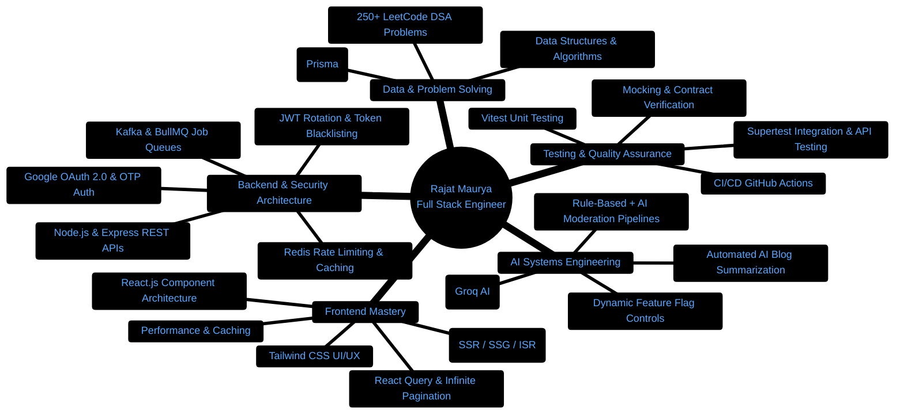

<div align="center">

  <h1>Hi, I'm Rajat Maurya 👋</h1>

  <p align="center">
    <a href="mailto:rajatmaurya.dev@gmail.com" title="Email Rajat">
      
    </a>
    &nbsp;&nbsp;&nbsp;&nbsp;
    <a href="https://www.linkedin.com/in/rajat-maurya-3a172331b" target="_blank" title="LinkedIn Profile">
      
    </a>
    &nbsp;&nbsp;&nbsp;&nbsp;
    <a href="https://github.com/rajatmaurya-cs" target="_blank" title="GitHub Profile">
      
    </a>
  </p>

</div>

<br/>

---

## 👨‍💻 About Me

I am a passionate **Full Stack Engineer** and **Frontend Developer** with strong expertise in building scalable, secure, and performant production applications. Focused on **Next.js**, **React**, **Node.js**, **Redis**, and **AI-powered architectures**, I build systems engineered for high traffic and optimal user experience.

### ⚡ Technical Skills & Core Strengths

- 💻 **Languages:** C++, JavaScript (ES6), TypeScript
- ⚙️ **Backend:** Node.js, Express.js, Kafka, Redis, BullMQ, JWT (rotation & blacklisting), Google OAuth 2.0
- 🗄️ **Databases:** MongoDB, PostgreSQL (Prisma)
- 🌐 **Frontend:** React.js, Next.js (SSR/SSG/ISR), React Query (Infinite Queries), Tailwind CSS
- 🧪 **Testing:** Vitest, Supertest, Unit Testing, Integration Testing, API Testing, Mocking
- 🛠️ **DevOps:** Docker, GitHub Actions (CI), Git
- 🎯 **Core Strengths:** Secure Authentication Systems • Testing & QA • Rate Limiting & Caching • AI Content Moderation Pipelines • Role-Based Dashboards • Payment Gateway Integration • Background Job Processing

<br/>

<br/>

---

## 💼 Work Experience

<table>
  <tr>
    <td width="100%">
      <h3>🏢 Frontend Developer Intern — SmallFare</h3>
      <p><i>Apr 2026 – Jul 2026</i></p>
      <ul>
        <li>⚡ <b>Performance Optimization:</b> Implemented Server-Side Rendering (SSR) and Static Site Generation (SSG) using Next.js, significantly improving page load performance and FCP.</li>
        <li>⚡ <b>Smart Data Caching:</b> Optimized data fetching pipelines with caching and Incremental Static Regeneration (ISR), cutting API calls and improving scalability for large datasets.</li>
        <li>⚡ <b>Modular Component Architecture:</b> Architected reusable, modular React components with integrated pagination to consume dynamic REST API content seamlessly.</li>
      </ul>
      <p>
        <b>Tech Stack SVGs:</b><br/>
        
      </p>
    </td>
  </tr>
</table>

<br/>

---

## 🚀 Featured Projects

<div align="center">

### 🌟 Veyra — The Home for Modern Creators

*Full-Stack Production Blogging & Creator Platform powered by AI, Tiered Rate Limits, Subscriptions & Automated Moderation*

</div>

```
┌────────────────────────────────────────────────────────────────────────────────────────┐
│                                    VEYRA ARCHITECTURE                                  │
│                                                                                        │
│   [ Client / Creator ] ──> [ Next.js + React Query ] ──> [ Rate Limiter (Redis) ]       │
│                                                                 │                      │
│                                                                 ▼                      │
│   [ SuperAdmin Panel ] <── [ Express.js Backend ] <─── [ Auth: Google OAuth / JWT ]   │
│            │                       │                                                   │
│            ▼                       ├─────────► [ Groq AI Generation & Summarization ]   │
│   [ Config Snapshots ]             ├─────────► [ 2-Layer Comment Moderation Pipeline ]  │
│                                    ├─────────► [ Razorpay Subscription Verification ]  │
│                                    └─────────► [ MongoDB & Redis Caching Layer ]       │
└────────────────────────────────────────────────────────────────────────────────────────┘
```

<details open>
<summary><b>🔥 Key Engineering Highlights of Veyra (Click to expand/collapse)</b></summary>

<br/>

- 📊 **Real-Time Creator Dashboard:** Built complete analytics showing followers, likes, blogs, drafts, and comments in real time.
- 🤖 **AI Content Generation & Summarization:** Integrated Groq AI LLM APIs with manual editor fallbacks and tiered free/paid usage limits.
- 🛡️ **Two-Layer Comment Moderation:** Engineered a 2-stage moderation engine combining a JS rule-based spam/gibberish filter with an AI moderation layer, routing high-risk comments to author review queues.
- 🔒 **Enterprise-Grade Auth:** Implemented Google OAuth, OTP login, JWT access/refresh token rotation, and Redis-backed token blacklisting.
- ⏱️ **Redis-Backed Rate Limiting:** Prevented OTP & AI API abuse with a rolling 12-hour reset on per-user AI usage limits.
- 💳 **Razorpay Subscriptions:** Webhook & cryptographic signature verification (`order_id` + `payment_id`) to unlock higher AI usage tiers.
- 👑 **SuperAdmin Control Panel:** Dynamic feature flags to toggle AI capabilities, set global/per-plan limits, adjust burst rate limits, and update plan pricing dynamically with audit logs & config snapshots.
- ⚡ **Optimized Data Layer:** Leveraged React Query caching and `React Infinite Query` for smooth, lag-free paginated feed browsing.

<br/>

**Tech Stack SVGs:**
<p align="left">
  
</p>
<p align="left">
  
  
  
</p>

</details>

<br/>

---

## 🗺️ Engineering Focus & System Architecture


```mermaid
%%{init: {'theme':'base','themeVariables':{
  'primaryColor':'#0d1117',
  'primaryTextColor':'#58a6ff',
  'primaryBorderColor':'#1f6feb',
  'lineColor':'#8b949e',
  'secondaryColor':'#161b22',
  'tertiaryColor':'#21262d',
  'background':'#0d1117'
}}}%%
mindmap
  root((Rajat Maurya<br/>Full Stack Engineer))

    Frontend Mastery
      Next.js (SSR / SSG / ISR)
      React.js Component Architecture
      React Query & Infinite Pagination
      Performance & Caching
      Tailwind CSS UI/UX

    Backend & Security Architecture
      Node.js & Express REST APIs
      JWT Rotation & Token Blacklisting
      Google OAuth 2.0 & OTP Auth
      Redis Rate Limiting & Caching
      Kafka & BullMQ Job Queues

    AI Systems Engineering
      LLM API Integration (Groq AI)
      Rule-Based + AI Moderation Pipelines
      Automated AI Blog Summarization
      Dynamic Feature Flag Controls

    Testing & Quality Assurance
      Vitest Unit Testing
      Supertest Integration & API Testing
      Mocking & Contract Verification
      CI/CD GitHub Actions

    Data & Problem Solving
      250+ LeetCode DSA Problems
      MongoDB & PostgreSQL (Prisma)
      Data Structures & Algorithms
```

<br/>

---

## 🏆 Education & Key Achievements

<table>
  <tr>
    <td width="50%" valign="top">
      <h3>🎓 Education</h3>
      <ul>
        <li><b>B.Tech in Computer Science Engineering</b><br/>KIET Group of Institutions, Ghaziabad<br/><b>CGPA: 8.04 / 10</b></li>
        <li><b>Class XII</b> — Rajasthan Board (92.40%)</li>
        <li><b>Class X</b> — Rajasthan Board (90.00%)</li>
      </ul>
    </td>
    <td width="50%" valign="top">
      <h3>🏅 Key Achievements</h3>
      <ul>
        <li><b>250+ LeetCode Solved:</b> Strong command over Data Structures & Algorithms (Arrays, Trees, Graphs, Dynamic Programming).</li>
        <li><b>Multi-Layer Moderation Pipeline:</b> Designed & implemented a two-tier AI + rule-based content moderation engine reducing manual review workload.</li>
        <li><b>Enterprise Security Patterns:</b> Implemented production-grade security standards (OAuth 2.0, JWT token rotation, Redis blacklisting, dynamic rate limiting).</li>
      </ul>
    </td>
  </tr>
</table>

<br/>

---

## 🐍 GitHub Contribution Grid

<div align="center">
  
</div>

<br/>

---

<div align="center">

  ### 🤝 Let's Connect & Build Together!

  <p align="center">
    <a href="mailto:rajatmaurya.dev@gmail.com" title="Email Rajat">
      
    </a>
    &nbsp;&nbsp;&nbsp;&nbsp;
    <a href="https://www.linkedin.com/in/rajat-maurya-3a172331b" target="_blank" title="LinkedIn Profile">
      
    </a>
    &nbsp;&nbsp;&nbsp;&nbsp;
    <a href="https://github.com/rajatmaurya-cs" target="_blank" title="GitHub Profile">
      
    </a>
  </p>

  <br/>

  <!-- Visitor Count -->
  

  <br/><br/>

  <i>Designed with ❤️ for Rajat Maurya</i>

</div>
